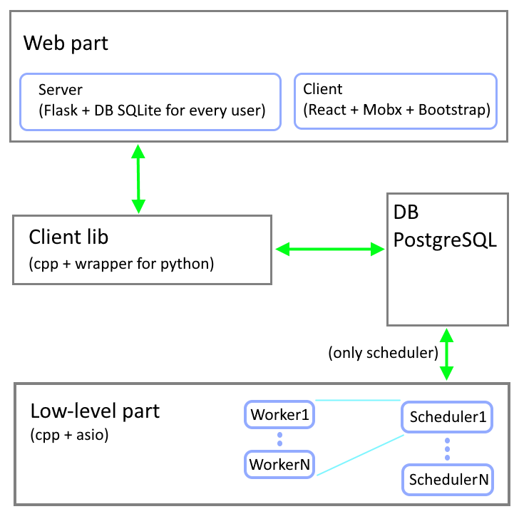

   

 
The Zmey software for schedule and monitor workflows.
   

## Features

* Multi-user system, each user has his own independent task pool
* Run multiple tasks in parallel on multiple machines
* Linking tasks into chains and graphs for sequential execution
* Automatic transmission of the task execution result for the following tasks
* Automatic start of tasks by time (cyclically or at a specific time)
* Quick deployment of the system:
  * Installing schedulers and executors on working machines from standard packages (deb, rpm), or docker image;
  * Installing a web server using pip (python package manager)
* Unlimited (logically) number of workers and users of the system
* Simple and intuitive user interface
* MIT Licensed

## Architecture 

 

The task queue is based on the PostgreSQL DB.  
Schedulers periodically poll the database to receive new tasks (using the 'listen-notify' mechanism built into the database).  
Each scheduler has its own pull workers, and when a new task is received, a free worker is selected.  
The maximum number of tasks that a worker can take on is set when the worker is added to the database.  
The worker does not have access to the database, all the results of task execution are transferred to the database by the scheduler.  
Schedulers and workers are created on the administrator page in the web user interface.  
and can be run on any machine on the network.  
 
The web server is built on the Flask micro-framework.  
A local SQLite database is created for each user to store the state of the interface.  
 
The web client is React application, Mobx is used for control of state, Boostrap design.

## How usage

 -in the Dockerfile you need to change the connection string to the postgres database, where I have: "DbConnectStr = host=192.168.0.104 port=5432 user=alm password=123 dbname=zmeydb", you specify your connection string. Any empty database will do, no tables need to be created.

 -create the image:
 docker build . -t zmcore

 -create the subnet:
 docker network create --subnet=172.18.0.0/16 zmnet

 -start the web server:
 docker container run -it --rm --net zmnet --ip 172.18.0.2 -p 5000:5000 zmcore flask run --host 0.0.0.0

 -on the host machine in the browser, open the page 172.22.0.1:5000/ (172.22.0.1 is the gateway address for the docker for me, your address may be different) and go to the admin panel, you need to set: login 'admin', password 'p@ssw0rd'(the password is hardcoded in the code). Add a scheduler and a worker, it should look like this:

 

 - then launch the scheduler:
 docker container run -it --rm --net zmnet --ip 172.18.0.3  -p 4440:4440 zmcore build/Release/zmscheduler -la=172.18.0.3:4440 -db="host=192.168.0.104 port=5432 user=alm password=123 dbname=zmeydb"
 Here the argument -la = 172.18.0.3: 4440 is the container address and port, we specified it when creating the scheduler in the admin panel, -db is the database connection string (you must have your own).

 - then launch the worker:
 docker container run -it --rm --net zmnet --ip 172.18.0.4 -p 4450:4450 zmcore build/Release/zmworker -la=172.18.0.4:4450 -sa=172.18.0.3:4440
 Here the argument -la = 172.18.0.4: 4450 is the address of the container and the port, we specified it when creating the worker in the admin panel, -sa = 172.18.0.3: 4440 is the address of the container sheduler.

 - then on the host machine in the browser go to the registration page 172.22.0.1:5000/auth/register, create any user, then log in from him.

 As a result, the main page of the application should open:

 

 

You can also install a web server from pip: `pip install zmeyweb`

## [Docs (on development stage)](https://tyill.github.io/zmey) 

## License
Licensed under an [MIT-2.0]-[license](LICENSE).
